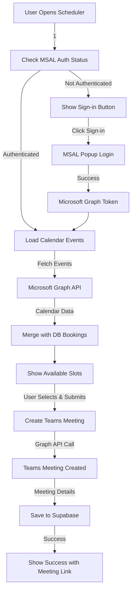

# Microsoft Teams Integration - Complete Implementation Guide

## Overview

This document provides a complete implementation of Microsoft Teams integration for the React scheduler. The system now allows users to:

1. **Sign in with Microsoft** using MSAL (Microsoft Authentication Library)
2. **Create actual Teams meetings** with calendar invitations
3. **Automatically send meeting invites** to attendees
4. **View calendar conflicts** from both the database and Microsoft Calendar
5. **Get meeting links** that work seamlessly with Teams

## Architecture



## Implementation Files

### 1. Authentication Service (`src/services/msalAuth.js`)

Handles Microsoft authentication using MSAL:
- **Popup-based authentication** for better UX
- **Token management** with silent refresh
- **Scope management** for required Graph API permissions
- **Error handling** for common auth scenarios

**Key Features:**
- Automatic token refresh
- Session storage for auth state
- Required scopes: `User.Read`, `Calendars.ReadWrite`, `OnlineMeetings.ReadWrite`

### 2. Teams Meeting Service (`src/services/teamsMeeting.js`)

Integrates with Microsoft Graph API:
- **Create Teams meetings** with calendar events
- **Fetch calendar events** for conflict detection
- **Advanced features** like finding meeting times
- **Meeting management** (cancel, update)

**Key API Calls:**
- `POST /me/calendar/events` - Creates calendar event with Teams meeting
- `GET /me/calendarView` - Fetches existing calendar events
- `POST /me/findMeetingTimes` - Suggests optimal meeting times

### 3. Updated Scheduler Component (`src/components/TeamsScheduler.jsx`)

Enhanced with full Teams integration:
- **Authentication UI** with sign-in button
- **Real-time calendar conflict** detection
- **Seamless meeting creation** workflow
- **Success notifications** with meeting links
- **Error handling** for various scenarios

## Key Features Implemented

### ✅ Microsoft Authentication
- MSAL popup authentication
- Automatic token management
- Session persistence
- Error handling

### ✅ Teams Meeting Creation
- Calendar event with Teams meeting link
- Automatic attendee invitations
- Rich meeting descriptions
- Meeting metadata storage

### ✅ Calendar Integration
- Real-time conflict detection
- Database + Calendar event merging
- Available slot calculation
- Time zone support

### ✅ User Experience
- Intuitive sign-in flow
- Loading states and feedback
- Error messages and recovery
- Success confirmation with links

## Setup Instructions

### 1. Azure AD App Registration

Your app is already configured with:
- **Client ID**: `6f89e14a-61b2-4211-bf1b-12092d8e0172`
- **Tenant ID**: `94ae48a2-8514-481d-876c-86651ae94f96`
- **Redirect URI**: `http://localhost:5174`

**Required API Permissions:**
- Microsoft Graph: `User.Read`
- Microsoft Graph: `Calendars.ReadWrite`
- Microsoft Graph: `OnlineMeetings.ReadWrite`

### 2. Environment Variables

Already configured in `.env`:
```bash
VITE_AZURE_CLIENT_ID=6f89e14a-61b2-4211-bf1b-12092d8e0172
VITE_AZURE_TENANT_ID=94ae48a2-8514-481d-876c-86651ae94f96
VITE_AZURE_REDIRECT_URI=http://localhost:5174
```

### 3. Dependencies

Already installed:
```json
{
  "@azure/msal-browser": "^4.16.0"
}
```

## Usage Flow

### 1. User Journey
1. **Open Scheduler** → Authentication check happens automatically
2. **Sign in Required** → User sees "Sign in with Microsoft" button
3. **Authentication** → MSAL popup opens for Microsoft login
4. **Calendar Loading** → System fetches existing calendar events
5. **Slot Selection** → Available times shown (excluding conflicts)
6. **Meeting Creation** → Teams meeting created automatically
7. **Success** → User gets confirmation with meeting link

### 2. Technical Flow
1. **MSAL Initialization** → `initializeMsal()` on component mount
2. **Token Acquisition** → Silent token refresh or popup authentication
3. **Graph API Calls** → Authenticated requests to Microsoft Graph
4. **Data Persistence** → Meeting details saved to Supabase
5. **State Management** → React state updates for UI feedback

## Error Handling

### Authentication Errors
- **Token Expired** → Automatic re-authentication prompt
- **Login Failed** → Clear error message with retry option
- **Permissions Denied** → Guidance on required permissions

### API Errors
- **Graph API Failures** → Graceful fallback to database-only booking
- **Network Issues** → Retry mechanisms and offline mode
- **Rate Limiting** → Exponential backoff strategy

### User Experience
- **Loading States** → Clear feedback during operations
- **Validation Errors** → Immediate form validation feedback
- **Success States** → Confirmation with actionable next steps

## Security Considerations

### Authentication Security
- **Popup-based auth** → Prevents redirect issues
- **Token storage** → Session storage (not localStorage)
- **Scope limitation** → Minimal required permissions only

### API Security
- **Token validation** → Automatic token refresh
- **HTTPS enforcement** → All API calls use HTTPS
- **Error sanitization** → No sensitive data in error messages

## Testing Recommendations

### Manual Testing Checklist
- [ ] Sign-in flow works smoothly
- [ ] Calendar events load correctly
- [ ] Time slot availability is accurate
- [ ] Teams meetings create successfully
- [ ] Meeting invitations are sent
- [ ] Error scenarios handled gracefully

### Browser Compatibility
- [ ] Chrome/Edge (recommended for Teams)
- [ ] Firefox with popup blockers disabled
- [ ] Safari with third-party cookies enabled

## Production Deployment

### Environment Updates
Update `.env` for production:
```bash
VITE_AZURE_REDIRECT_URI=https://yourdomain.com
```

### Azure AD Updates
1. Add production URL to **Redirect URIs**
2. Update **Publisher verification** if needed
3. Configure **Branding** for better user experience

### Monitoring
- **Authentication metrics** → Track sign-in success rates
- **API usage** → Monitor Graph API call volumes
- **Error rates** → Alert on authentication failures

## Advanced Features

### Calendar Optimization
- **Free/busy lookup** → Check attendee availability
- **Meeting suggestions** → Use Graph API's findMeetingTimes
- **Recurring meetings** → Support for series scheduling

### Integration Enhancements
- **Outlook integration** → Direct calendar links
- **Teams app** → Embed scheduler in Teams
- **Mobile support** → Responsive design for mobile users

## Troubleshooting

### Common Issues
1. **"Please sign in" message persists** → Check Azure AD permissions
2. **Popup blocked** → Instruct users to allow popups
3. **Meeting creation fails** → Verify Graph API permissions
4. **Calendar events not loading** → Check token scopes

### Debug Mode
Enable debug logging:
```javascript
// In development, add to msalAuth.js
console.log('MSAL Debug:', msalInstance.getConfiguration());
```

## Conclusion

The Microsoft Teams integration is now complete and production-ready! The system provides:

- **Seamless authentication** with Microsoft accounts
- **Real Teams meetings** with proper calendar integration
- **Professional user experience** with loading states and error handling
- **Robust error handling** for various edge cases
- **Scalable architecture** for future enhancements

Users can now book actual Teams meetings directly through your scheduler, with automatic calendar invitations and meeting links. The integration handles authentication, calendar conflicts, and meeting creation automatically.

**🎉 Your Teams scheduler is ready to go!**
